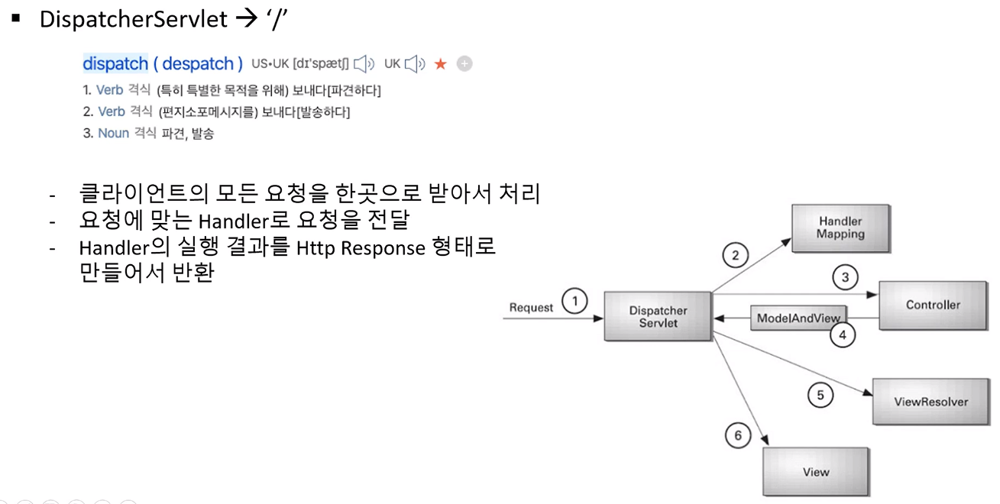
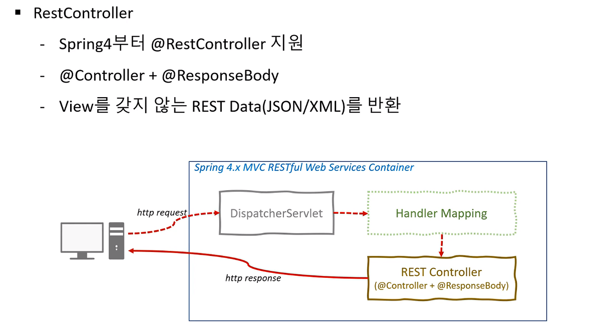
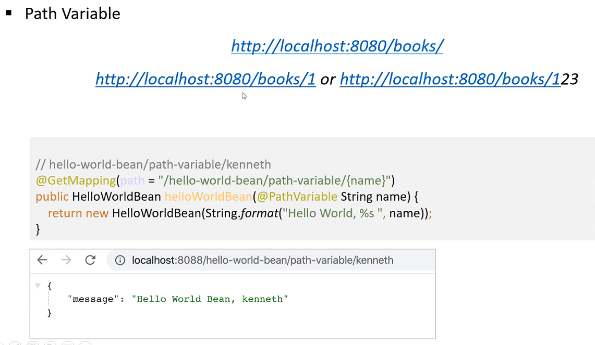

# 1. Spring Boot로 개발하는 RESTful Service

## 프로젝트 구성

- java 11
- queryDSL 5.0
- spring-boot 2.6.3
- spring-boot-devtools
- spring-web
- h2 database
- thymeleaf
- lombok

**gradle 설정**
```gradle
buildscript { 
    ext { queryDslVersion = "5.0.0"
    } 
}

plugins {
	id 'org.springframework.boot' version '2.6.3'
	id 'io.spring.dependency-management' version '1.0.11.RELEASE'
	id "com.ewerk.gradle.plugins.querydsl" version "1.0.10" //querydsl 추가 
	id 'java'
}

group = 'com.study'
version = '0.0.1-SNAPSHOT'
sourceCompatibility = '11'

configurations {
	compileOnly {
		extendsFrom annotationProcessor
	}
}

repositories {
	mavenCentral()
}

dependencies {
	implementation 'org.springframework.boot:spring-boot-starter-data-jpa'
	implementation 'org.springframework.boot:spring-boot-starter-thymeleaf'
	implementation 'org.springframework.boot:spring-boot-starter-web'

	//querydsl 추가 
    implementation "com.querydsl:querydsl-jpa:${queryDslVersion}" 
    annotationProcessor "com.querydsl:querydsl-apt:${queryDslVersion}"

	compileOnly 'org.projectlombok:lombok'
	developmentOnly 'org.springframework.boot:spring-boot-devtools'
	runtimeOnly 'com.h2database:h2'
	annotationProcessor 'org.projectlombok:lombok'
	testImplementation 'org.springframework.boot:spring-boot-starter-test'
}

tasks.named('test') {
	useJUnitPlatform()
}

//querydsl 추가 시작 
def querydslDir = "$buildDir/generated/querydsl"
querydsl { 
    jpa = true 
	querydslSourcesDir = querydslDir 
}

sourceSets {
     main.java.srcDir querydslDir 
} 

configurations { 
    querydsl.extendsFrom compileClasspath 
}

compileQuerydsl { 
     options.annotationProcessorPath = configurations.querydsl 
} 
//querydsl 추가 끝
```

**application.yml 설정**
```yml
spring:
  datasource:
    url: jdbc:h2:tcp://localhost/~/restapi
    username: sa
    password: 
    driver-class-name: org.h2.Driver
    
  jpa:
    hibernate:
      ddl-auto: create-drop
    properties:
      hibernate:
#        show_sql: true # System.out을 통해 출력
        format_sql: true
        use_sql_comments: true
        dialect: org.hibernate.dialect.H2Dialect
        default_batch_fetch_size: 100
server:
  port: 8080
  
logging:
  level:
    org.springframework: debug

```

## REST API 설계

|설명|REST API|HTTP Method|
|---|---|---|
|모든 사용자 조회|/users|GET|
|사용자 생성|/users|POST|
|특정 사용자 조회|/users/{id}|GET|
|특정 사용자 삭제|/users/{id}|DELETE|
|특정 사용자의 모든 포스트 조회|/users/{id}/posts|GET|
|특정 사용자의 포스트 생성|/users/{id}/posts|POST|
|특정 사용자의 특정 포스트의 내용 조회|/users/{id}/posts/{post_id}|GET|

## HelloController 생성
**HelloDto** 작성
```java
@AllArgsConstructor
@NoArgsConstructor
@Getter
public class HelloDto {
    private String message; 
}
```

**HelloController** 작성
```java

@RestController
public class HelloController {

    @GetMapping("/hello")
    public String hello() {
        return "hello!";
    }

    @GetMapping(path = "/hello-dto")
    public HelloDto helloDto() {
        return new HelloDto("hello!");
    }
}
```

## SpringBoot 동작의 이해
- DispatcherServletAutoConfiguration: `DispatcherServlet`관리하는 구성 클래스
- ErrorMvcAutoConfiguration
- HttpMessageConvertersAutoConfiguration: 클라이언트에 요청결과를 응답을 반환하기 위해 사용하는 구성 클래스 기본적으로 JSON 포맷으로 응답

## DispatcherServlet


## RestController


## PathVariable 사용
URI에 가변 변수를 사용 할 수 있는 방법


**HelloController** PathVariable 적용
```java
@RestController
public class HelloController {

    @GetMapping("/hello")
    public String hello() {
        return "hello!";
    }
    
    @GetMapping(path = "/hello-dto")
    public HelloDto helloDto() {
        return new HelloDto("hello!");
    }

    @GetMapping(path = "/hello-dto/{name}")
    public HelloDto helloDtoUsingPathVariable(@PathVariable(name = "name") String name) {
        return new HelloDto(String.format("Hello! %s", name));
    }
}
```