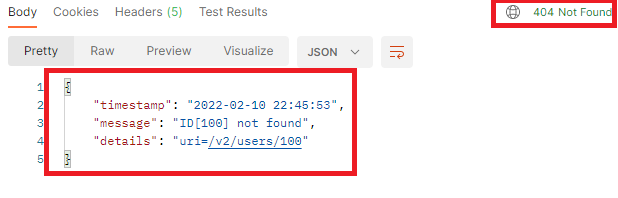

# 2. User Service API 구현
## UserRest API 설계
## REST API 설계

|설명|REST API|HTTP Method|
|---|---|---|
|모든 사용자 조회|/users|GET|
|사용자 생성|/users|POST|
|특정 사용자 조회|/users/{id}|GET|
|특정 사용자 삭제|/users/{id}|DELETE|

## User Domain 생성
```java
@EntityListeners(AuditingEntityListener.class)
@NoArgsConstructor(access = AccessLevel.PROTECTED)
@Getter
@Entity
public class User {
    
    @Id @GeneratedValue
    private Long id;

    @Setter
    private String name;

    @CreatedDate
    @Column(updatable = false)
    private LocalDateTime joinDate;

    @Builder
    private User(String name) {
        this.name = name;
    }
}
```

## UserRepository 생성

```java
public interface UserRepository extends JpaRepository<User, Long> {
    
}
```

## UserService 생성
```java
@RequiredArgsConstructor
@Service
@Transactional
public class UserService {
    
    private final UserRepository userRepository;

    @Transactional
    public Long saveUser(User user) {
        User savedUser = userRepository.save(user);
        return savedUser.getId();
    }

    public Optional<UserDto> findOneUser(Long id) {
        Optional<User> findUser = userRepository.findById(id);
        if (findUser.isPresent()) {
            User user = findUser.get();
            UserDto userDto = new UserDto(user.getId(), user.getName(), user.getJoinDate());
            return Optional.of(userDto);
        } else {
            return Optional.empty();
        }
    }

    public List<UserDto> findAll() {
        return userRepository
                    .findAll()
                    .stream()
                    .map(user -> new UserDto(user.getId(), user.getName(), user.getJoinDate()))
                    .collect(Collectors.toList());
    }

    @Transactional
    public void removeUser(Long id) {
        Optional<User> findUser = userRepository.findById(id);
        if (findUser.isPresent()) { 
            userRepository.delete(findUser.get());
        }
    }

    @Transactional
    public Optional<UserDto> updateUser(UserRequestDto userRequestDto) {
        Optional<User> findUser = userRepository.findById(userRequestDto.getId());
        if(findUser.isPresent()) {
            User user = findUser.get();
            user.setName(userRequestDto.getName());
            UserDto userDto = new UserDto(user.getId(), user.getName(), user.getJoinDate());
            return Optional.of(userDto);
        } 
        return Optional.empty();
    }
}
```

## 애플리케이션 시작할 때 User 데이터를 집어 넣기 위한 DataInitializer 작성
```java
@RequiredArgsConstructor
@Service
@Transactional
public class UserService {
    
    private final UserRepository userRepository;

    @Transactional
    public Long saveUser(User user) {
        User savedUser = userRepository.save(user);
        return savedUser.getId();
    }

    public Optional<UserDto> findOneUser(Long id) {
        Optional<User> findUser = userRepository.findById(id);
        if (findUser.isPresent()) {
            User user = findUser.get();
            UserDto userDto = new UserDto(user.getId(), user.getName(), user.getJoinDate());
            return Optional.of(userDto);
        } else {
            return Optional.empty();
        }
    }
}
```

## DTO 작성
```java
@Setter @Getter
public abstract class BaseDto {
    protected int code = HttpStatus.OK.value();
    protected String message = "success";
}

@AllArgsConstructor
@Getter
public class UserDto {
    private Long id;

    @Setter
    private String name;

    @Setter
    @JsonSerialize(using = LocalDateTimeSerializer.class)
    @JsonFormat(pattern = "yyyy-MM-dd HH:mm:ss") /** JSON 날짜 응답 포맷 지정 */
    private LocalDateTime joinDate;
}

@Getter @Setter
@NoArgsConstructor
public class UserResponseDto extends BaseDto {
    
    /**
     * https://javadeveloperzone.com/spring/spring-jackson-exclude-null-fields/
     */
    @JsonInclude(JsonInclude.Include.NON_NULL)
    private UserDto user;        // 필드가 NULL 일시 JSON 프로퍼티에서 삭제됨

    @JsonInclude(JsonInclude.Include.NON_NULL)
    private List<UserDto> users; // 필드가 NULL 일시 JSON 프로퍼티에서 삭제됨

    public UserResponseDto(int code, String message) {
        this.code = code;
        this.message = message;
    }
}

@NoArgsConstructor
@Getter @Setter
public class UserRequestDto {
    private Long id;
    private String name;

    @JsonSerialize(using = LocalDateTimeSerializer.class)
    @JsonFormat(pattern = "yyyy-MM-dd HH:mm:ss") /** JSON 날짜 응답 포맷 지정 */
    private LocalDateTime joinDate;
}
```
## API 버전 구분 인터페이스 작성

컨트롤러에서 구현하여 버전을 구분하는데 사용됨
```java
@RequestMapping("/v1")
public interface V1Controller {
    
}

@RequestMapping("/v2")
public interface V2Controller {
    
}
```

## API V1 버전 Controller
```java
@RestController
@RequiredArgsConstructor
public class UserControllerV1 implements V1Controller {

    private final UserService userService;

    @GetMapping("/users")
    public UserResponseDto retrieveAllUsers() {
        List<UserDto> users = userService.findAll();
        
        if (!users.isEmpty()) {
            UserResponseDto response = new UserResponseDto();
            response.setUsers(users);
            return response;
        }

        return new UserResponseDto(HttpStatus.NOT_FOUND.value(), "User list is empty");
    }

    @GetMapping("/users/{id}")
    public UserResponseDto retrieveUser(@PathVariable("id") Long id) {
        Optional<UserDto> user = userService.findOneUser(id);
        if (user.isPresent()) {
            UserResponseDto response = new UserResponseDto();
            response.setUser(user.get());
            return response;
        }
        return new UserResponseDto(HttpStatus.NOT_FOUND.value(), "User is not found");
    }

    /**
     * RestController에서 POST처리시 @RequestBody는 필수
     */
    @PostMapping("/users")
    public UserResponseDto createUser(@RequestBody UserRequestDto userRequestDto) {
        User user = User.builder()
            .name(userRequestDto.getName())
            .build();
        Long userId = userService.saveUser(user);
        Optional<UserDto> findUser = userService.findOneUser(userId);
        
        if (findUser.isPresent()) {
            UserResponseDto response = new UserResponseDto();
            response.setUser(findUser.get());
            return response;
        }
        return new UserResponseDto(HttpStatus.BAD_REQUEST.value(), "Registering new user is failed");
    }

    @DeleteMapping("/users/{id}")
    public UserResponseDto removeUser(@PathVariable("id") Long id) {
        userService.removeUser(id);
        return new UserResponseDto();
    }
}
```

## API V2 버전 Controller
모든 API이 성공시 응답코드를 하나의 단일되어 있는 코드값 200으로 응답하는 것 보다, 적절한 예외핸들링 등을 조합해서 응답시  
상황에 맞는 적절한 응답코드 값을 내보내는 것이 중요

**예외 클래스**
```java
@ResponseStatus(HttpStatus.NOT_FOUND) // 이 예외가 던지면 클라이언트에 404 코드가 전달됨
@NoArgsConstructor
public class UserNotFoundException extends RuntimeException {

    public UserNotFoundException(String message) {
        super(message);
    }
}
```

다음과 같이 일반화된 예외 발생시 응답 클래스를 생성할 수도 있다
```java
@NoArgsConstructor
@AllArgsConstructor
@Setter @Getter
public class ExceptionResponse {

    @JsonSerialize(using = LocalDateTimeSerializer.class)
    @JsonFormat(pattern = "yyyy-MM-dd HH:mm:ss") /** JSON 날짜 응답 포맷 지정 */
    private LocalDateTime timestamp;
    private String message;
    private String details;;
}
```

그리고 **컨트롤러 공통적으로 발생하는 예외**를 처리하고 응답하기 위한 메서드 핸들러 클래스를 작성한다.  
- `ResponseEntityExceptionHandler`의 역할
  - [참고1](https://blog.naver.com/PostView.naver?blogId=writer0713&logNo=221605253778&parentCategoryNo=&categoryNo=83&viewDate=&isShowPopularPosts=true&from=search)
  - [참고2](https://docs.spring.io/spring-framework/docs/current/javadoc-api/org/springframework/web/servlet/mvc/method/annotation/ResponseEntityExceptionHandler.html)
  - [참고3](https://supawer0728.github.io/2019/04/04/spring-error-handling/)

```java
@RestController
@ControllerAdvice /** 모든 컨트롤러가 실행될때 @ControllerAdvice가 붙은 빈이 실행되도록 되어있다 */
public class CustomizedResponseEntityExceptionHandler extends ResponseEntityExceptionHandler {
    
    @ExceptionHandler(Exception.class) // Exception이 발생할 경우 이 핸들러가 실행됨
    public final ResponseEntity<Object> handleAllExceptions(Exception ex, WebRequest request) {
        ExceptionResponse exceptionResponse 
            = new ExceptionResponse(LocalDateTime.now(), ex.getMessage(), request.getDescription(false));

        return new ResponseEntity(exceptionResponse, HttpStatus.INTERNAL_SERVER_ERROR);
    }

    @ExceptionHandler(UserNotFoundException.class) // UserNotFoundException이 발생할 경우 이 핸들러가 실행됨
    public final ResponseEntity<Object> handleUserNotFoundException(Exception ex, WebRequest request) {
        ExceptionResponse exceptionResponse 
            = new ExceptionResponse(LocalDateTime.now(), ex.getMessage(), request.getDescription(false));
        return new ResponseEntity(exceptionResponse, HttpStatus.NOT_FOUND);
    }
}
```
**UserNotFoundException**이 발생했을 때 결과는 다음과 같음


구현된 **V2버전의 Controller**는 다음과 같음
```java
@RestController
@RequiredArgsConstructor
public class UserControllerV2 implements V2Controller {
    
    private final UserService userService;

    @GetMapping("/users")
    public List<UserDto> retrieveAllUsers() {
        List<UserDto> users = userService.findAll();
        return users;
    }

    @GetMapping("/users/{id}")
    public UserDto retrieveUser(@PathVariable("id") Long id) {
        Optional<UserDto> user = userService.findOneUser(id);
        if (user.isPresent()) {
           return user.get();
        }
        throw new UserNotFoundException(String.format("ID[%s] not found", id));
    }

    /**
     * RestController에서 POST처리시 @RequestBody는 필수
     */
    @PostMapping("/users")
    public ResponseEntity<Void> createUser(@RequestBody UserRequestDto userRequestDto) {
        User user = User.builder()
            .name(userRequestDto.getName())
            .build();
        Long id = userService.saveUser(user);

        /**
         * 현재 요청 URI /users에 /{id}를 추가하여 /users/{id}로 URI를 만들고
         * {id}에 id값을 매핑한 URI 생성
         */
        URI location = ServletUriComponentsBuilder.fromCurrentRequest()
            .path("/{id}") 
            .buildAndExpand(id)
            .toUri();
        
        /** 201 상태 응답값 반환 
         *  응답헤더 Location 키에 위에서 만든 URI 값이 매핑됨 http://localhost:8080/v2/users/4
         */
        return ResponseEntity.created(location).build();
    }

    @DeleteMapping("/users/{id}")
    public void removeUser(@PathVariable("id") Long id) {
        userService.removeUser(id);
    }

    @PutMapping("/users")
    public ResponseEntity<Void> updateUser(@RequestBody UserRequestDto userRequestDto) {
        Optional<UserDto> findUser = userService.updateUser(userRequestDto);
        if (findUser.isEmpty()) {
            throw new UserNotFoundException(String.format("ID[%s] not found", userRequestDto.getId()));
        }
        URI location = ServletUriComponentsBuilder.fromCurrentRequest()
            .path("/{id}")
            .buildAndExpand(userRequestDto.getId())
            .toUri();
        
        HttpHeaders responseHeaders = new HttpHeaders();
        responseHeaders.setLocation(location);
        
        return new ResponseEntity<Void>(responseHeaders, HttpStatus.OK);
    }
}
```
