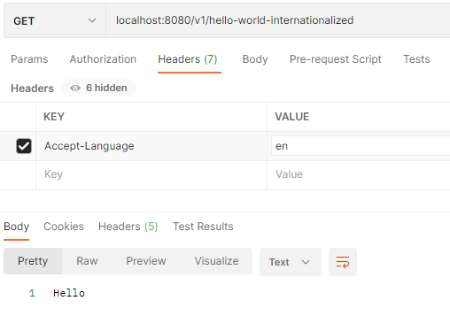
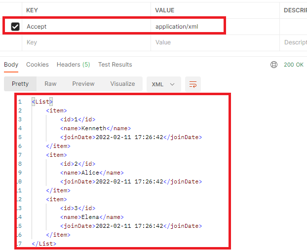
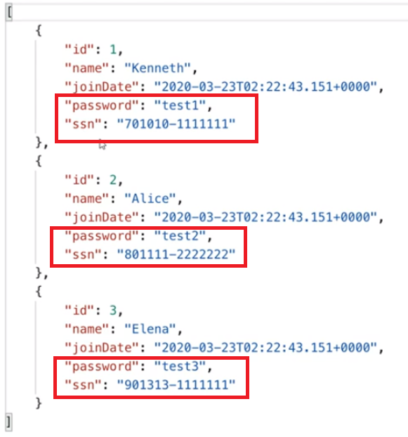

# 3. RESTful Service 기능 확장  

## RESTful 서비스를 위한 유효성 체크 구현 - 1
- 의존성 추가
  - 밸리데이션을 사용하기 위해서는 다음의 의존성을 추가한다
  - `implementation 'org.springframework.boot:spring-boot-starter-validation'`

- 유효성 검증 추가
  - DTO  
  ```java
  @NoArgsConstructor
  @Getter @Setter
  public class UserRequestDto {
      private Long id;
      
      @Size(min = 2)
      private String name;
  
      @JsonSerialize(using = LocalDateTimeSerializer.class)
      @JsonFormat(pattern = "yyyy-MM-dd HH:mm:ss") /** JSON 날짜 응답 포맷 지정 */
      @Past
      private LocalDateTime joinDate;
  }
  ```
  - Controller  
  ```java
  @RestController
  @RequiredArgsConstructor
  public class UserControllerV2 implements V2Controller {
      
      private final UserService userService;
  
      @GetMapping("/users")
      public List<UserDto> retrieveAllUsers() {
          List<UserDto> users = userService.findAll();
          return users;
      }
  
      @GetMapping("/users/{id}")
      public UserDto retrieveUser(@PathVariable("id") Long id) {
          Optional<UserDto> user = userService.findOneUser(id);
          if (user.isPresent()) {
             return user.get();
          }
          throw new UserNotFoundException(String.format("ID[%s] not found", id));
      }
  
      /**
       * @Valid 어노테이션 추가하여 밸리데이션 활성화
       */
      @PostMapping("/users")
      public ResponseEntity<Void> createUser(@RequestBody @Valid UserRequestDto userRequestDto) {
          User user = User.builder()
              .name(userRequestDto.getName())
              .build();
          Long id = userService.saveUser(user);
  
          URI location = ServletUriComponentsBuilder.fromCurrentRequest()
              .path("/{id}") 
              .buildAndExpand(id)
              .toUri();
          return ResponseEntity.created(location).build();
      }
  
      @DeleteMapping("/users/{id}")
      public void removeUser(@PathVariable("id") Long id) {
          userService.removeUser(id);
      }
  
      /**
       * @Valid 어노테이션 추가하여 밸리데이션 활성화
       */
      @PutMapping("/users")
      public ResponseEntity<Void> updateUser(@RequestBody @Valid UserRequestDto userRequestDto) {
          Optional<UserDto> findUser = userService.updateUser(userRequestDto);
          if (findUser.isEmpty()) {
              throw new UserNotFoundException(String.format("ID[%s] not found", userRequestDto.getId()));
          }
          URI location = ServletUriComponentsBuilder.fromCurrentRequest()
              .path("/{id}")
              .buildAndExpand(userRequestDto.getId())
              .toUri();
          
          HttpHeaders responseHeaders = new HttpHeaders();
          responseHeaders.setLocation(location);
          
          return new ResponseEntity<Void>(responseHeaders, HttpStatus.OK);
      }
  }
  ```
  - 예외 핸들러 메서드 추가
  ```java
  @RestController
  @ControllerAdvice /** 모든 컨트롤러가 실행될때 @ControllerAdvice가 붙은 빈이 실행되도록 되어있다 */
  public class CustomizedResponseEntityExceptionHandler extends ResponseEntityExceptionHandler {
      //... 생략
      /**
       * 밸리데이션 실패에 대한 응답을 처리하는 메서드 오버라이드 하여 구현
       */
      @Override
      public final ResponseEntity<Object> handleMethodArgumentNotValid(
          MethodArgumentNotValidException ex, HttpHeaders headers, HttpStatus status, WebRequest request) {
  
          ExceptionResponse exceptionResponse 
              = new ExceptionResponse(LocalDateTime.now(), ex.getMessage(), ex.getBindingResult().toString());
          return new ResponseEntity(exceptionResponse, HttpStatus.BAD_REQUEST);
      }
  }
  ```
  - 결과  
    

## RESTful 서비스를 위한 유효성 체크 구현 - 2
- 유효성 검증 DTO에 검증실패시 메시지 추가
```java
@NoArgsConstructor
@Getter @Setter
public class UserRequestDto {
    private Long id;
    
    //  @Size(min = 2, message = "{greeting.message}") - 다국어 메시지 propoerties 파일의 greeting.message를 읽어서 처리할 수 도 있게 됨 
    @Size(min = 2, message = "name은 2글자 입력해주세요") 
    private String name;

    @JsonSerialize(using = LocalDateTimeSerializer.class)
    @JsonFormat(pattern = "yyyy-MM-dd HH:mm:ss") /** JSON 날짜 응답 포맷 지정 */
    @Past(message = "날짜 포맷이 \'yyyy-MM-dd HH:mm:ss\'이 아닙니다")
    private LocalDateTime joinDate;
}
```
- 예외 핸들러 메서드 수정
```java
@RestController
@ControllerAdvice /** 모든 컨트롤러가 실행될때 @ControllerAdvice가 붙은 빈이 실행되도록 되어있다 */
public class CustomizedResponseEntityExceptionHandler extends ResponseEntityExceptionHandler {
    //...
    /**
     * 밸리데이션 실패에 대한 응답을 처리하는 메서드 오버라이드 하여 구현
     */
    @Override
    public final ResponseEntity<Object> handleMethodArgumentNotValid(
        MethodArgumentNotValidException ex, HttpHeaders headers, HttpStatus status, WebRequest request) {
            
            String defaultMessage = ex.getAllErrors().get(0).getDefaultMessage();

        ExceptionResponse exceptionResponse 
            = new ExceptionResponse(LocalDateTime.now(), defaultMessage, ex.getBindingResult().toString());
        return new ResponseEntity(exceptionResponse, HttpStatus.BAD_REQUEST);
    }
}
```
- 결과  
  

## 다국어 처리
세션을 통해서 Locale 값을 얻어오기 위해 `SessionLocaleResolver` 빈을 다음과 같이 설정한다.
```java
import java.util.Locale;

import org.springframework.boot.SpringApplication;
import org.springframework.boot.autoconfigure.SpringBootApplication;
import org.springframework.context.annotation.Bean;
import org.springframework.data.jpa.repository.config.EnableJpaAuditing;
import org.springframework.web.servlet.LocaleResolver;
import org.springframework.web.servlet.i18n.SessionLocaleResolver;

@EnableJpaAuditing
@SpringBootApplication
public class StartApplication {

	public static void main(String[] args) {
		SpringApplication.run(StartApplication.class, args);
	}

	@Bean
	public LocaleResolver localeResolver() {
		SessionLocaleResolver localeResolver = new SessionLocaleResolver();
		localeResolver.setDefaultLocale(Locale.KOREA);
		return localeResolver;
	}
}
```
  
다국어 파일을 식별하는 파일명을 다음과 같이 설정한다.
```yml
spring:
  messages:
    basename: messages # 다국어 식별 기본 파일명

  datasource:
    url: jdbc:h2:tcp://localhost/~/restapi
    username: sa
    password: 
    driver-class-name: org.h2.Driver
    
  jpa:
    hibernate:
      ddl-auto: create
    properties:
      hibernate:
#        show_sql: true # System.out을 통해 출력
        format_sql: true
        use_sql_comments: true
        dialect: org.hibernate.dialect.H2Dialect
        default_batch_fetch_size: 100

logging:
  level:
   # org.hibernate.SQL: debug #logger를 통해 출력
   # org.hibernate.type: trace #SQL 쿼리 파라미터를 확인할 수 있다
   # org.springframework: debug
    com.study: info
```
여러개의 다국어 처리 파일이 필요하다면 다음과 같이 선언한다.
```java
@Configuration
public class AppConfiguration {

    @Bean
    public MessageSource messageSource() {
        ReloadableResourceBundleMessageSource messageSource
                = new ReloadableResourceBundleMessageSource();
        messageSource.setBasenames(
                "classpath:/messages/api_error_messages",
                "classpath:/messages/api_response_messages"
        );
        messageSource.setDefaultEncoding("UTF-8");
        return messageSource;
    }
```

application.yml 파일에서는 다음에 같이 적용해 볼 수 있다.

```yml
spring:
  messages:
    basename: messages1, messages2
```
다음과 같이 `resources` 폴더 아래에 다국어 파일을 만든다.  
파일명 규칙은 `yml`에서 정의한 `기본파일명_ISO언어코드.properties`형태로 파일명이 구성된다.  
  
  
- messsages.properties
```properties
greeting.message=안녕하세요
```
- messsages_en.properties
```properties
greeting.message=Hello
```

다국어 테스트를 위한 컨트롤러 작성
```java
@RestController
@RequiredArgsConstructor
public class HelloControllerV1 implements V1Controller {
    
    private final MessageSource messageSource;

    @GetMapping(path = "/hello-world-internationalized")
    public String helloWorldInternationalized( // 요청 헤더의 Accept-Language의 값으로 Locale 설정하고 없으면 부트에서 설정한 기본 Locale 적용
            @RequestHeader(name = "Accept-Language", required = false)  Locale locale) {
        return messageSource.getMessage("greeting.message", null, locale);
    }
}
```
결과  
  
  
## Response 데이터 형식 변환 - XML format
- 의존성 라이브러리 추가
  - `implementation 'com.fasterxml.jackson.dataformat:jackson-dataformat-xml'`
- POSTMAN을 통해 요청 헤더 값을 `Accept: application/xml`로 설정 후 API를 호출한다.  
  

## Response 데이터 제어를 위한 Filtering
API통해 응답되는 데이터 중에 중요데이터는 클라이언트가 바로 받아보는 것이 아니라 제어하는 법에 대해서 알아본다  
  
- User 도메인 수정
```java
@EntityListeners(AuditingEntityListener.class)
@NoArgsConstructor(access = AccessLevel.PROTECTED)
@Getter
@Entity
public class User {
    
    @Id @GeneratedValue
    private Long id;

    @Setter
    private String name;

    @Setter
    private String password;

    @Setter
    private String ssn;

    @CreatedDate
    @Column(updatable = false)
    private LocalDateTime joinDate;

    @Builder
    private User(String name, String password, String ssn) {
        this.name = name;
        this.password = password;
        this.ssn = ssn;
    }
}
```
- UserService 수정
```java
@RequiredArgsConstructor
@Service
@Transactional
public class UserService {
    
    private final UserRepository userRepository;

    @Transactional
    public Long saveUser(User user) {
        User savedUser = userRepository.save(user);
        return savedUser.getId();
    }

    public Optional<UserDto> findOneUser(Long id) {
        Optional<User> findUser = userRepository.findById(id);
        if (findUser.isPresent()) {
            User user = findUser.get();
            UserDto userDto = new UserDto(user.getId(), user.getName(), user.getJoinDate(), user.getPassword(), user.getSsn());
            return Optional.of(userDto);
        } else {
            return Optional.empty();
        }
    }

    public List<UserDto> findAll() {
        return userRepository
                    .findAll()
                    .stream()
                    .map(user -> new UserDto(user.getId(), user.getName(), user.getJoinDate(), user.getPassword(), user.getSsn()))
                    .collect(Collectors.toList());
    }

    @Transactional
    public void removeUser(Long id) {
        Optional<User> findUser = userRepository.findById(id);
        if (findUser.isPresent()) { 
            userRepository.delete(findUser.get());
        }
    }

    @Transactional
    public Optional<UserDto> updateUser(UserRequestDto userRequestDto) {
        Optional<User> findUser = userRepository.findById(userRequestDto.getId());
        if(findUser.isPresent()) {
            User user = findUser.get();
            user.setName(userRequestDto.getName());
            user.setPassword(userRequestDto.getPassword());
            user.setSsn(userRequestDto.getSsn());
            
            UserDto userDto = new UserDto(user.getId(), user.getName(), user.getJoinDate(), user.getPassword(), user.getSsn());
            return Optional.of(userDto);
        } 
        return Optional.empty();
    }
}
```

- DTO 수정
```java
@NoArgsConstructor
@Getter @Setter
public class UserRequestDto {
    private Long id;
    
    @Size(min = 2, message = "name은 2글자 입력해주세요")
    private String name;

    @JsonSerialize(using = LocalDateTimeSerializer.class)
    @JsonFormat(pattern = "yyyy-MM-dd HH:mm:ss") /** JSON 날짜 응답 포맷 지정 */
    @Past(message = "날짜 포맷이 \'yyyy-MM-dd HH:mm:ss\'이 아닙니다")
    private LocalDateTime joinDate;
    private String password;
    private String ssn;
}


@AllArgsConstructor
@Getter
public class UserDto {
    private Long id;

    @Setter
    private String name;

    @Setter
    @JsonSerialize(using = LocalDateTimeSerializer.class)
    @JsonFormat(pattern = "yyyy-MM-dd HH:mm:ss") /** JSON 날짜 응답 포맷 지정 */
    private LocalDateTime joinDate;

    @Setter
    private String password;

    @Setter
    private String ssn;
}
```

