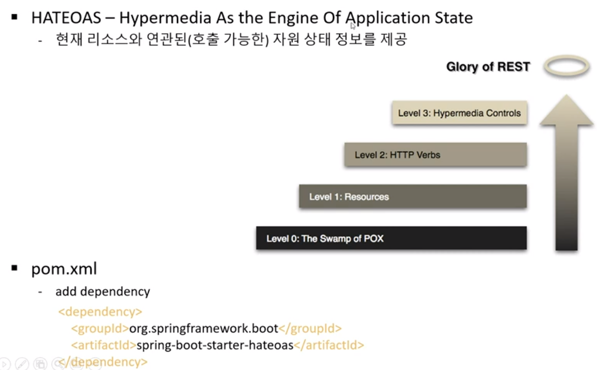
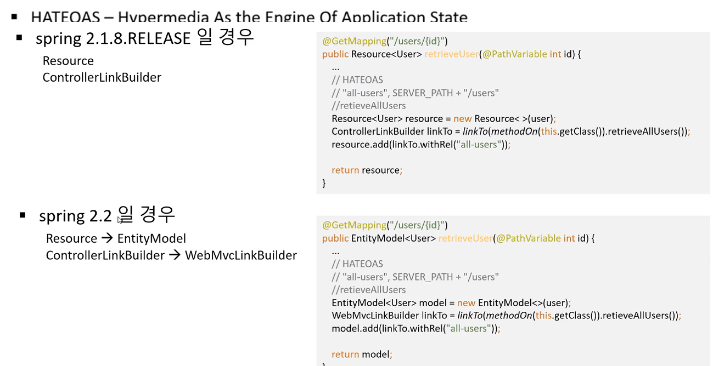
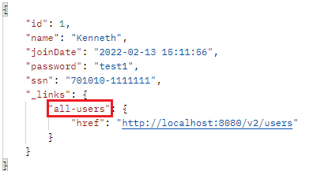
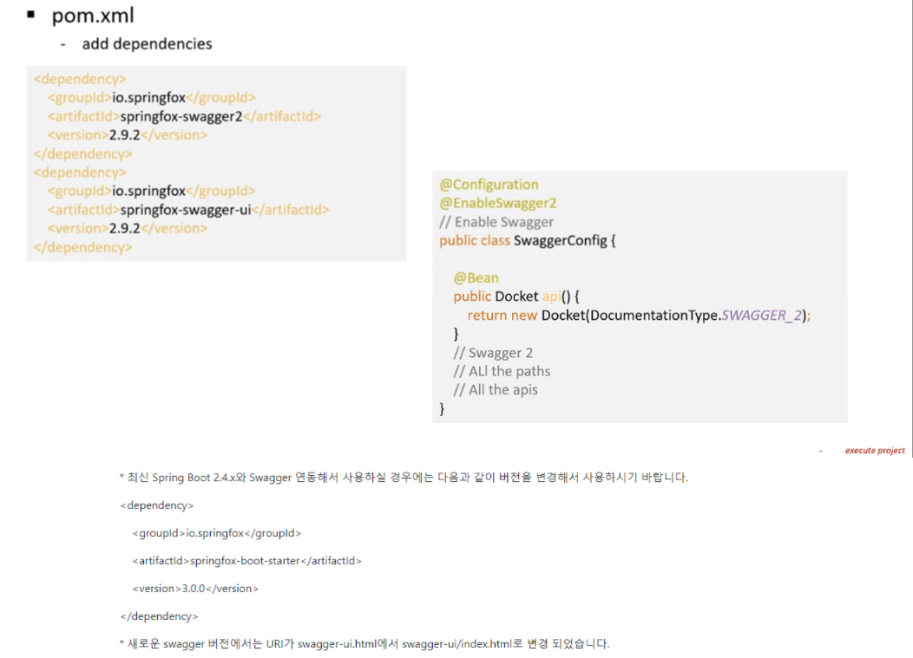
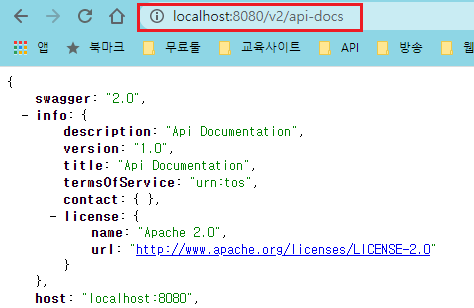
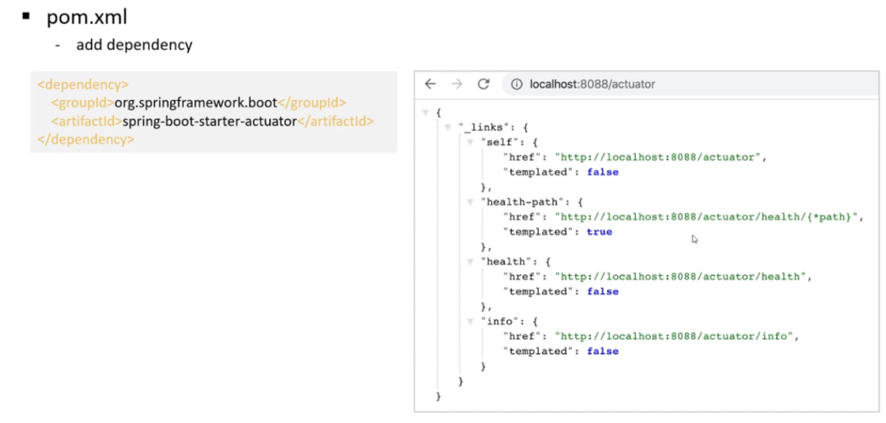

# 4. Spring Boot API 사용  
## REST API에 HATEOAS 적용
  

- `build.gradle`에 의존성 추가

```gradle
implementation 'org.springframework.boot:spring-boot-starter-hateoas'
```

- `spring boot 2.1.x`와 `spring boot 2.2.x`이상 버전에서 HATEOAS 구현시 차이점
  

- Spring Boot 2.6.3 버전 기준으로 HAEOAS 구현
```java
@GetMapping("/users/{id}")
public EntityModel<UserDto> retrieveUser(@PathVariable("id") Long id) {
    Optional<UserDto> user = userService.findOneUser(id);
    if (user.isPresent()) {
        // HATEOAS
        UserDto userDto = user.get();
        EntityModel<UserDto> model = EntityModel.of(userDto);

        // 현재 컨트롤러의 retrieveAllUser 메서드를 이용해서 링크 생성
        WebMvcLinkBuilder linkTo = WebMvcLinkBuilder
                    .linkTo(WebMvcLinkBuilder.methodOn(this.getClass()).retrieveAllUsers());
        model.add(linkTo.withRel("all-users"));
        return model;
    }

    throw new UserNotFoundException(String.format("ID[%s] not found", id));
}
```
- `@JsonFilter` 적용한 Dto를 HATEOAS로 처리하는 방법
```java
@RequiredArgsConstructor
@RestController
public class AdminUserControllerV2 implements V2Controller {

    private final UserService userService;

    @GetMapping("/admin/users")
    public MappingJacksonValue retrieveAllUsers() {
        List<UserDto> users = userService.findAll();

        // 컬렉션을 반환할때는 CollectionModel을 사용
        CollectionModel<UserDto> model = CollectionModel.of(users);

        // 현재 컨트롤러의 retrieveAllUser 메서드를 이용해서 링크 생성
        WebMvcLinkBuilder linkTo = WebMvcLinkBuilder
                    .linkTo(WebMvcLinkBuilder.methodOn(this.getClass()).retrieveAllUsers());
        model.add(linkTo.withRel("all-users"));

        SimpleBeanPropertyFilter filter = SimpleBeanPropertyFilter.filterOutAllExcept("id", "name", "joinDate", "ssn");
        FilterProvider filterProvider = new SimpleFilterProvider().addFilter("UserInfo", filter); // @JsonFilter("UserInfo"), filter

        MappingJacksonValue mapping = new MappingJacksonValue(users);
        mapping.setFilters(filterProvider);
        
        return mapping;
    }

    @GetMapping(value = "/admin/users/{id}")
    public MappingJacksonValue retrieveUser(@PathVariable("id") Long id) {
        Optional<UserDto> user = userService.findOneUser(id);
        if (user.isPresent()) {
            SimpleBeanPropertyFilter filter = SimpleBeanPropertyFilter.filterOutAllExcept("id", "name", "joinDate", "ssn", "grade");
            FilterProvider filterProvider = new SimpleFilterProvider().addFilter("UserInfoV2", filter); // @JsonFilter("UserInfoV2"), filter

            UserDtoV2 userDtoV2 = new UserDtoV2();
            userDtoV2.setGrade("VIP");

            BeanUtils.copyProperties(user.get(), userDtoV2); // 같은 필드명이 있다면 그 필드의 데이터를 동일한 필드명에 복사 - setter메서드가 필수적으로 있어야함
            
            EntityModel<UserDtoV2> model = EntityModel.of(userDtoV2);

            // 현재 컨트롤러의 retrieveUser 메서드를 이용해서 링크 생성
            WebMvcLinkBuilder linkTo = WebMvcLinkBuilder
                        .linkTo(WebMvcLinkBuilder.methodOn(this.getClass()).retrieveUser(userDtoV2.getId()));
            model.add(linkTo.withRel("user-url"));

            MappingJacksonValue mapping = new MappingJacksonValue(model);
            mapping.setFilters(filterProvider);
            return mapping;
        }
        throw new UserNotFoundException(String.format("ID[%s] not found", id));
    }
}
```


- 결과  
  

## REST API Documentation을 위한 Swagger 사용 
  

- 오류 발생시 참고 - (스프링 부트 버전에 따른 호환성 문제 발생가능성 있음)
  - [링크1](https://www.baeldung.com/swagger-2-documentation-for-spring-rest-api)
  - `Spring Boot 2.6.x`버전 이후에 `spring.mvc.pathmatch.matching-strategy` 값이 `ant-apth-matcher`에서 `path-pattern-parser`로 변경되면서  
  몇몇 라이브러리(swagger포함)에 오류가 발생 `application.yml` 다음과 같이 수정
  ```yml
  spring:
    mvc:
      pathmatch:
        matching-strategy: ant-path-matcher
  ``` 
  

- build.gradle에 Swagger 의존성 추가 - `Spring Boot 2.6.x`기준
```gradle
implementation 'io.springfox:springfox-boot-starter:3.0.0' // Swagger
```

- Swagger 구성 클래스 작성
```java
@Configuration
@EnableSwagger2
public class SwaggerConfig {

    @Bean
    public Docket api() {
        return new Docket(DocumentationType.SWAGGER_2);
    }
}
```

- `localhost:<설정포트>/v2/api-docs`를 입력후 Swagger가 잘 동작하는지 확인  
  

- Swagger html로 이동하기
  - Swagger2: `http://localhost:<설정포트>/swagger-ui.html`
  - Swagger3: `http://localhost:<설정포트>/swagger-ui/index.html`

## Swagger Documentation 커스터 마이징
- Swagger 구성 클래스 수정
```java
@Configuration
@EnableSwagger2
public class SwaggerConfig {
    
    /** API 생성한 사람 연락처 Default 정보 */
    private static final Contact DEFAULT_CONTACT = new Contact("JongTae, Heo", "https://github.com/kiosk123",
            "heo9910@naver.com");

    /** API Default 정보 */
    private static final ApiInfo DEFAULT_API_INFO = new ApiInfo("Rest APi",
            "My test Rest API",
            "1.0",
            "urn:tos",
            DEFAULT_CONTACT,
            "Apache 2.0",
            "http://www.apache.org/licenses/LICENSE-2.0",
            new ArrayList<>());

    /** 지원하는 데이터 타입 정보 */
    private static final Set<String> DEFAULT_PRODUCES_AND_CONSUMES = new HashSet<>(
        Arrays.asList(MediaType.APPLICATION_JSON_VALUE, MediaType.APPLICATION_XML_VALUE));

    @Bean
    public Docket api() {
        return new Docket(DocumentationType.SWAGGER_2)
                .apiInfo(DEFAULT_API_INFO)
                .produces(DEFAULT_PRODUCES_AND_CONSUMES)
                .consumes(DEFAULT_PRODUCES_AND_CONSUMES);
    }
}
```

- DTO 객체에 대한 Documentation 추가하기
```java
@NoArgsConstructor
@AllArgsConstructor
@Getter @Setter
@JsonFilter("UserInfo")
@ApiModel(description = "사용자 상세 정보를 위한 객체") // Swagger
public class UserDto {
    private Long id;

    @ApiModelProperty(notes = "사용자 이름을 입력해 주세요") // Swagger
    private String name;

    @JsonSerialize(using = LocalDateTimeSerializer.class)
    @JsonFormat(pattern = "yyyy-MM-dd HH:mm:ss") /** JSON 날짜 응답 포맷 지정 */
    @ApiModelProperty(notes = "사용자 가입날짜") // Swagger
    private LocalDateTime joinDate;

    @ApiModelProperty(notes = "사용자 패스워드를 입력해주세요") // Swagger
    private String password;

    @ApiModelProperty(notes = "사용자 주민번호를 입력해주세요") // Swagger
    private String ssn;
}
```

- Controller에 적용하기 - 1
```java
@RestController
public class HelloController {
    
    @Operation(summary = "test hello", description = "hello api example")
    @ApiResponses({
        @ApiResponse(responseCode = "200", description = "OK !!"),
            @ApiResponse(responseCode = "400", description = "BAD REQUEST !!"),
            @ApiResponse(responseCode = "404", description = "NOT FOUND !!"),
            @ApiResponse(responseCode = "500", description = "INTERNAL SERVER ERROR !!")
    })
    @GetMapping("/hello")
    public ResponseEntity<String> hello(@Parameter(description = "이름", required = true, example = "Park") @RequestParam String name) {
        return ResponseEntity.ok("hello " + name);
    }
}
```

- Controller에 적용하기 - 2
```java
@GetMapping("/users")
@ApiOperation(value = "GET_ALL_USERS", notes = "get all users information")
public List<UserDto> retrieveAllUsers() {
    List<UserDto> users = userService.findAll();
    return users;
}
```

## Actuator를 이용한 REST API Monitoring
      
- build.gradle 의존성 추가
```gradle
implementation 'org.springframework.boot:spring-boot-starter-actuator'
```